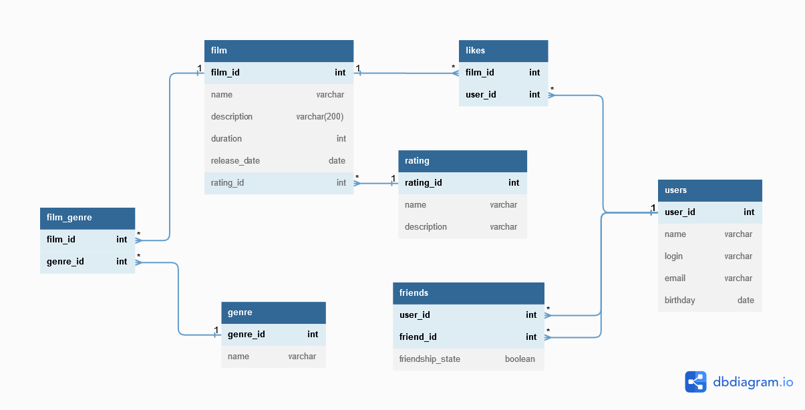

# JAVA Filmorate project.
**Содержание**


1. [ER-диаграмма](README.md#ER-диаграмм)
2. [Описание таблиц](README.md#Описание-таблиц)
3. [Скрипты для Film](README.md#Скрипты-для-Film)
4. [Скрипты для Users](README.md#Скрипты-для-Users)



## Описание таблиц

[//]: # (#### Films)
<details><summary>Film</summary>

| Столбец      | Тип          | Описание                  | Примечание           |
|--------------|--------------|---------------------------|----------------------|
| film_id      | bigint       | уникальный идентификатор  | PK                   |
| name         | varchar      | название фильма           | NOT NULL             |
| description  | varchar(200) | описание фильма           |                      |
| release_date | date         | дата релиза               | NOT NULL             |
| duration     | int          | длительность фильма в мин |                      |
| rating_id    | int          | id рейтинга               | FK(rating.rating_id) |

</details>

[//]: # (#### )
<details><summary>User_info</summary>

| Столбец  | Тип          | Описание                 | Примечание       |
|----------|--------------|--------------------------|------------------|
| user_id  | bigint       | уникальный идентификатор | PK               |
| name     | varchar      | имя пользователя         |                  |
| login    | varchar(100) | логин                    | NOT NULL, UNIQUE |
| email    | varchar(320) | email                    | NOT NULL, UNIQUE |
| birthday | date         | день рождения            | NOT NULL         |
</details>

[//]: # (#### )
<details><summary>Friendship</summary>

| Столбец          | Тип     | Описание                                                                    | Примечание                |
|------------------|---------|-----------------------------------------------------------------------------|---------------------------|
| user_id          | bigint  | id пользователя                                                             | PK, FK(user_info.user_id) |
| friend_id        | bigint  | id друга                                                                    | PK, FK(user_info.user_id) |
| friendship_state | boolean | подтверждение дружбы<br/>false - неподтверждённая<br/>true - подтверждённая | default = false           |
</details>

[//]: # (#### )
<details><summary>Likes</summary>
 каждый пользователь может поставить лайк фильму только один раз

| Столбец | Тип    | Описание        | Примечание                |
|---------|--------|-----------------|---------------------------|
| film_id | bigint | id фильма       | PK, FK(film.film_id)      |
| user_id | bigint | id пользователя | PK, FK(user_info.user_id) |

</details>

[//]: # (#### )
<details><summary>Genre(Список жанров)</summary>

| Столбец  | Тип          | Описание                 | Примечание |
|----------|--------------|--------------------------|------------|
| genre_id | int          | уникальный идентификатор | PK         |
| name     | varchar(100) | название                 | NOT NULL   |

| genre_id | name           |
|----------|----------------|
| 1        | Комедия        |
| 2        | Драма          |
| 3        | Мультфильм     |
| 4        | Триллер        |
| 5        | Документальный |
| 6        | Боевик         |

</details>

[//]: # (#### )
<details><summary>Film_genre</summary>
У фильма может быть сразу несколько жанров

| Столбец  | Тип    | Описание  | Примечание             |
|----------|--------|-----------|------------------------|
| film_id  | bigint | id фильма | PK, FK(film.film_id)   |
| genre_id | int    | id жанра  | PK, FK(genre.genre_id) |

</details>

[//]: # (#### )
<details><summary>Rating</summary>
Рейтинг Ассоциации кинокомпаний (англ. Motion Picture Association, сокращённо МРА). Эта оценка определяет возрастное ограничение для фильма.

| Столбец     | Тип          | Описание                 | Примечание |
|-------------|--------------|--------------------------|------------|
| rating_id   | int          | уникальный идентификатор | PK         |
| name        | varchar(200) | название                 | NOT NULL   |
| description | varchar      | описание                 |            |

| rating_id | name   | description                                                              |
|-----------|--------|--------------------------------------------------------------------------|
| 1         | 	G     | нет возрастных ограничений                                               |
| 2         | 	PG    | детям рекомендуется смотреть фильм с родителями                          |
| 3         | 	PG-13 | детям до 13 лет просмотр не желателен                                    |
| 4         | 	R     | лицам до 17 лет просматривать фильм можно только в присутствии взрослого |
| 5         | 	NC-17 | лицам до 18 лет просмотр запрещён                                        |
</details>

## Скрипты
[Создание таблиц](src/main/resources/schema.sql)
### для Film

+ _GET /films_
````roomsql
SELECT f.film_id, f.name, f.description, f.duration, f.release_date, r.name AS rating_name
FROM film f
LEFT JOIN rating r ON r.rating_id = f.rating_id;
````
+ _GET /films/{id}_
````roomsql
SELECT  f.film_id, 
        f.name, 
        f.description, 
        f.duration, 
        f.release_date, 
        r.name AS rating_name 
FROM film f
LEFT JOIN rating r ON r.rating_id = f.rating_id
WHERE f.film_id = {id};
````
+ _POST /films_
````roomsql
INSERT INTO film
(name, description, duration, release_date)
VALUES({name}, {description}, {duration}, {release_date});
````
* _PUT /films_
````roomsql
UPDATE film
SET name = {name}, description = {description}, duration = {duration}, release_date = {release_date}
WHERE film_id = {id};
````

[//]: # (````)

[//]: # (update public.film)

[//]: # (SET rating_id = 2)

[//]: # (WHERE film_id= 7;)

[//]: # (````)
* _DELETE /films/{id}_
````roomsql
DELETE FROM film
WHERE film_id = {id};
````
* _PUT /films/{id}/like/{userId}_
````roomsql
INSERT INTO likes (film_id, user_id)
VALUES ({id}, {userId})
ON CONFLICT DO NOTHING;
````
* _DELETE /films/{id}/like/{userId}_
````roomsql
DELETE FROM likes
WHERE film_id = {id} AND user_id = {userId};
````
* _GET /films/popular?count={count}_
````roomsql
SELECT f.film_id, f.name, f.description, f.duration, f.release_date, 
       r.name AS rating_name, 
       COUNT(l.film_id) count_likes 
FROM FILM f 
LEFT JOIN likes l ON f.FILM_ID = l.FILM_ID  
LEFT JOIN rating r ON r.rating_id = f.rating_id
GROUP BY f.film_id 
ORDER BY count(l.film_id) DESC, f.film_id ASC
LIMIT {count};
````
___
###  для User_info

[//]: # (#### Получить список всех друзей )
* _GET /users_
````roomsql
SELECT user_id, name, login, email, birthday
FROM user_info;
````
* _POST /users_
````roomsql
INSERT INTO users_info
(name, login, email, birthday)
VALUES({name}, {login}, {email}, {birthday});
````
* _PUT /users_
````roomsql
UPDATE users_info
SET name = {name}, login = {login}, email = {email}, birthday = {birthday}
WHERE user_id = {id};
````
* _DELETE /users/{id}_
````roomsql
DELETE FROM users_info
WHERE user_id = {id};
````

[//]: # (#### Получить список друзе)
* _GET /users/{id}/friends_
````roomsql
SELECT u.user_id, u.name, u.login,u.email, u.birthday
FROM friendship f2
LEFT JOIN users u ON u.user_id = f2.friend_id 
WHERE f2.user_id = {id}
````

[//]: # (#### Добавить друга)
* _PUT /users/{id}/friends/{friendId}_
````roomsql
INSERT INTO friendship
VALUES ({id}, {friendId})
ON CONFLICT DO NOTHING;
````

[//]: # (#### Подтверждение дружбы)
[//]: # (````)

[//]: # (UPDATE friends)

[//]: # (SET friendship_state = true)

[//]: # (WHERE &#40;user_id={id} AND friend_id={friendId}&#41;;)

[//]: # (````)

[//]: # (#### Удалить друга)
* _DELETE /users/{id}/friends/{friendId}_
````roomsql
DELETE FROM friendship 
WHERE (user_id = {id} AND friend_id = {friendId});
````

[//]: # (#### Получить общих друзей)
* _GET /users/{id}/friends/common/{otherId}_
````roomsql
SELECT u.user_id, u.name, u.login,u.email, u.birthday
FROM user_info u INNER JOIN (
    SELECT friend_id  FROM friendship f WHERE user_id = {id}
    INTERSECT 
    SELECT friend_id  FROM friendship f WHERE user_id = {otherId}
) f ON f.friend_id = u.user_id
````

