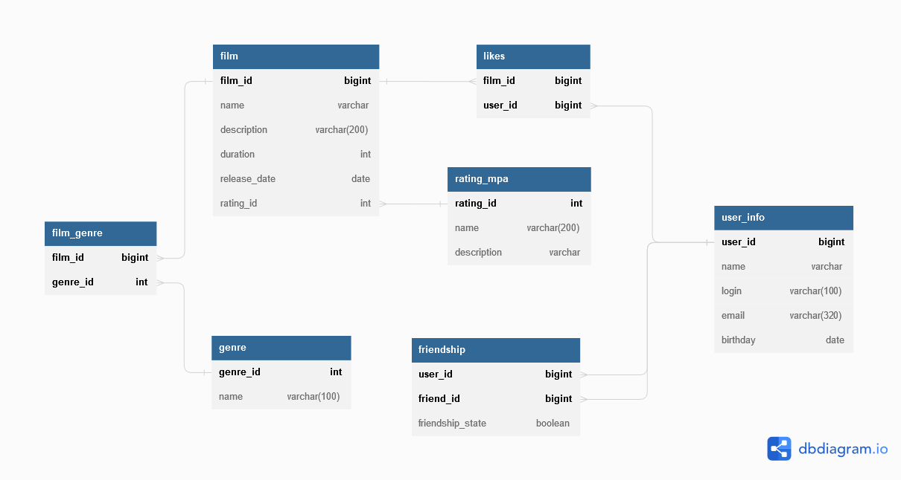

# JAVA Filmorate project.
**Содержание**


1. [ER-схема](README.md#ER-схема)
2. [Описание таблиц](README.md#Описание-таблиц)
3. [Скрипты для Film](README.md#Скрипты-для-Film)
4. [Скрипты для Users](README.md#Скрипты-для-Users)

## ER схема

[//]: # (![]&#40;https://github.com/catarena-s/java-filmorate/blob/main/docs/DB_schem.png?token=A2GDMWJSDNOBLOD4XL5AW7DDOUBGU&#41;)




## Описание таблиц

[//]: # (#### Films)
<details><summary>Films</summary>

| Столбец      | Тип          | Описание                 | Примечание |
|--------------|--------------|--------------------------|------------|
| film_id      | int          | уникальный идентификатор | PK         |
| name         | varchar      | название фильма          | not null   |
| description  | varchar(200) | описание фильма          |            |
| release_date | date         | дата релиза              | not null   |
| rating_id    | int          | id рейтинга              |            |

</details>

[//]: # (#### )
<details><summary>Users</summary>

| Столбец  | Тип     | Описание                 | Примечание |
|----------|---------|--------------------------|------------|
| user_id  | int     | уникальный идентификатор | PK         |
| name     | varchar | имя пользователя         |            |
| login    | varchar | логин                    | not null   |
| birthday | date    | день рождения            | not null   |
| email    | varchar | email                    | not null   |
</details>

[//]: # (#### )
<details><summary>Friends</summary>

| Столбец          | Тип     | Описание                                                                    | Примечание    |
|------------------|---------|-----------------------------------------------------------------------------|---------------|
| user_id          | int     | id пользователя                                                             | PK            |
| friend_id        | int     | id друга                                                                    | PK            |
| friendship_state | boolean | подтверждение дружбы<br/>false - неподтверждённая<br/>true - подтверждённая | default false |
</details>

[//]: # (#### )
<details><summary>Likes</summary>
 каждый пользователь может поставить лайк фильму только один раз

| Столбец | Тип | Описание        | Примечание |
|---------|-----|-----------------|------------|
| film_id | int | id фильма       | PK         |
| user_id | int | id пользователя | PK         |

</details>

[//]: # (#### )
<details><summary>Genre(Список жанров)</summary>

| Столбец  | Тип     | Описание                 | Примечание |
|----------|---------|--------------------------|------------|
| genre_id | int     | уникальный идентификатор | PK         |
| name     | varchar | название                 | not null   |

| genre_id | name           |
|----------|----------------|
| 1        | Комедия        |
| 2        | Драма          |
| 3        | Мультфильм     |
| 4        | Триллер        |
| 5        | Документальный |
| 6        | Боевик         |
| 7        | Приключения    |
| 8        | Фантастика     |
| 9        | Семейный       |

</details>

[//]: # (#### )
<details><summary>Film_genre</summary>
У фильма может быть сразу несколько жанров

| Столбец  | Тип | Описание  | Примечание |
|----------|-----|-----------|------------|
| film_id  | int | id фильма | PK         |
| genre_id | int | id жанра  | PK         |

</details>

[//]: # (#### )
<details><summary>Rating</summary>
Рейтинг Ассоциации кинокомпаний (англ. Motion Picture Association, сокращённо МРА). Эта оценка определяет возрастное ограничение для фильма.

| Столбец     | Тип     | Описание                 | Примечание |
|-------------|---------|--------------------------|------------|
| rating_id   | int     | уникальный идентификатор | PK         |
| name        | varchar | название                 | not null   |
| description | varchar | описание                 |            |

| rating_id | name   | description                                                              |
|-----------|--------|--------------------------------------------------------------------------|
| 1         | 	G     | нет возрастных ограничений                                               |
| 2         | 	PG    | детям рекомендуется смотреть фильм с родителями                          |
| 3         | 	PG-13 | детям до 13 лет просмотр не желателен                                    |
| 4         | 	R     | лицам до 17 лет просматривать фильм можно только в присутствии взрослого |
| 5         | 	NC-17 | лицам до 18 лет просмотр запрещён                                        |
</details>

##  Скрипты для Film

_GET /films_
````roomsql
SELECT f.film_id, f.name, f.description, f.duration, f.release_date, r.name AS rating_name
FROM film f
LEFT JOIN rating r ON r.rating_id = f.rating_id;
````
_GET /films/{id}_
````roomsql
SELECT  f.film_id, 
        f.name, 
        f.description, 
        f.duration, 
        f.release_date, 
        r.name AS rating_name 
FROM film f
LEFT JOIN rating r ON r.rating_id = f.rating_id
WHERE f.film_id = {id};
````
_POST /films_
````roomsql
INSERT INTO film
(name, description, duration, release_date)
VALUES({name}, {description}, {duration}, {release_date});
````
_PUT /films_
````roomsql
UPDATE film
SET name = {name}, description = {description}, duration = {duration}, release_date = {release_date}
WHERE film_id = {id};
````

[//]: # (````)

[//]: # (update public.film)

[//]: # (SET rating_id = 2)

[//]: # (WHERE film_id= 7;)

[//]: # (````)
_DELETE /films/{id}_
````roomsql
DELETE FROM film
WHERE film_id = {id};
````
_PUT /films/{id}/like/{userId}_
````roomsql
INSERT INTO likes (film_id, user_id)
VALUES ({id}, {userId})
ON CONFLICT (film_id, user_id)
DO UPDATE 
SET film_id = EXCLUDED.film_id, user_id = EXCLUDED.user_id;
````
_DELETE /films/{id}/like/{userId}_
````roomsql
DELETE FROM likes
WHERE film_id = {id} AND user_id = {userId};
````
_GET /films/popular?count={count}_
````roomsql
SELECT  f.film_id, 
	f.name, 
	f.description, 
	f.duration, 
	f.release_date, 
	r.name AS rating_name,
	count_likes 
FROM film f 
INNER JOIN (SELECT film_id, count(film_id) count_likes 
                FROM likes l  
                GROUP BY film_id 
                ORDER BY count(film_id) DESC 
                LIMIT {count})p ON p.film_id = f.film_id 
LEFT JOIN rating r ON r.rating_id = f.rating_id
ORDER BY count_likes DESC;
````
___
##  Скрипты для Users

[//]: # (#### Получить список всех друзей )
_GET /users_
````roomsql
SELECT user_id, name, login, email, birthday
FROM users;
````
_POST /users_
````roomsql
INSERT INTO users
(name, login, email, birthday)
VALUES({name}, {login}, {email}, {birthday});
````
_PUT /users_
````roomsql
UPDATE users
SET name = {name}, login = {login}, email = {email}, birthday = {birthday}
WHERE user_id = {id};
````
_DELETE /users/{id}_
````roomsql
DELETE FROM users
WHERE user_id = {id};
````

[//]: # (#### Получить список друзе)
_GET /users/{id}/friends_
````roomsql
SELECT u.user_id, u.name, u.login,u.email, u.birthday
FROM friends f2
LEFT JOIN users u ON u.user_id = f2.friend_id 
WHERE f2.user_id = {id}
````

[//]: # (#### Добавить друга)
_PUT /users/{id}/friends/{friendId}_
````roomsql
INSERT INTO friends
VALUES ({id}, {friendId})
ON CONFLICT (user_id, friend_id)
DO UPDATE 
SET user_id = EXCLUDED.user_id, friend_id = EXCLUDED.friend_id;

INSERT INTO friends
VALUES ({friendId}, {id})
ON CONFLICT (user_id, friend_id)
DO UPDATE 
SET user_id = EXCLUDED.user_id, friend_id = EXCLUDED.friend_id;
````

[//]: # (#### Подтверждение дружбы)
[//]: # (````)

[//]: # (UPDATE friends)

[//]: # (SET friendship_state = true)

[//]: # (WHERE &#40;user_id={id} AND friend_id={friendId}&#41;;)

[//]: # (````)

[//]: # (#### Удалить друга)
_DELETE /users/{id}/friends/{friendId}_
````roomsql
DELETE FROM friends 
WHERE (user_id = {id} AND friend_id = {friendId})
    or(user_id = {friendId} AND friend_id = {id});
````

[//]: # (#### Получить общих друзей)
_GET /users/{id}/friends/common/{otherId}_
````roomsql
SELECT u.user_id, u.name, u.login,u.email, u.birthday
FROM users u 
WHERE u.user_id in (
    SELECT friend_id  FROM friends f WHERE user_id = {id}
INTERSECT 
    SELECT friend_id  FROM friends f WHERE user_id = {otherId}
)
````

